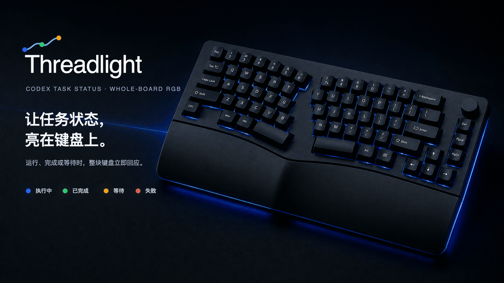
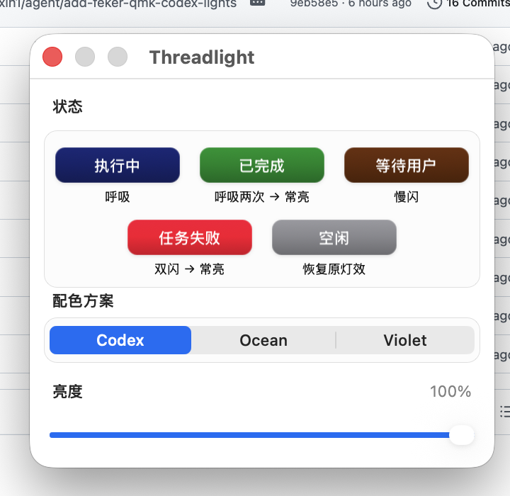
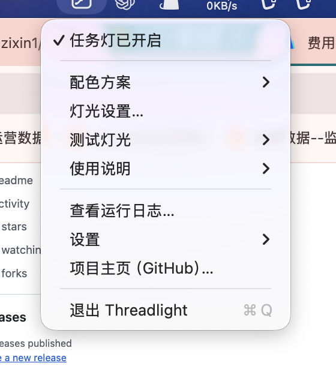
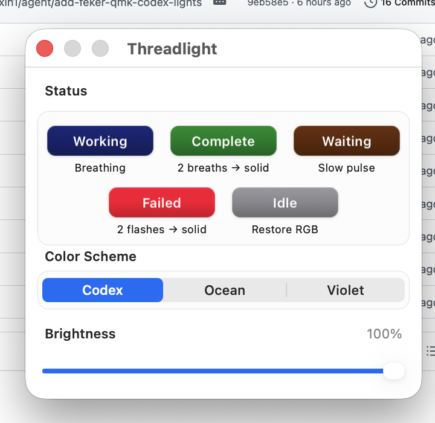

# Threadlight

<p align="center">
  <strong>让任务状态，亮在键盘上。</strong><br>
  See your Codex task status in the light of your keyboard.
</p>

<p align="center">
  
</p>

<p align="center">
  <a href="#中文">中文</a> · <a href="#english">English</a> ·
  <a href="assets/threadlight-hero-animated.mp4">MP4 Demo</a> ·
  <a href="assets/threadlight-hero-4k.jpg">4K Hero</a>
</p>

> Threadlight is an experimental, independent macOS utility. It is not affiliated with or endorsed by OpenAI, FEKER, QMK, or VIA. The keyboard in the hero is an illustrative product render; compatibility is defined by the USB table below.

---

# 中文

Threadlight 是一个轻量的 macOS 菜单栏应用。它只读观察本机 Codex 任务事件，并把状态显示在整块键盘或数字键 `1`–`9` 上。

- **不打断工作：** 不弹通知也能从键盘灯光看见任务进度。
- **不接管按键：** 没有数字键映射、全局快捷键或 Karabiner。
- **不需要 Hook：** 无须修改 Codex 配置，也不需要 API Key 或“输入监控”权限。
- **用完即恢复：** 暂停或退出时恢复键盘原有 RGB 灯效。

## 界面

<table>
  <tr>
    <td width="62%"></td>
    <td width="38%"></td>
  </tr>
  <tr>
    <td align="center">范围、配色、状态动画与亮度</td>
    <td align="center">菜单栏里的全部操作</td>
  </tr>
</table>

## 灯光范围

| 范围 | 行为 | 固件要求 |
| --- | --- | --- |
| 整个键盘 | 汇总所有任务，显示最高优先级状态 | 原厂 QMK/VIA 固件 |
| 数字键 `1`–`9` | 对应最近 9 个本地 Codex 主任务，并按侧栏置顶顺序优先排列；顺序变化时自动重排，后台 subagent 和旧的置顶记录不占编号，其他位置全部熄灭 | [Threadlight RGB9 v0.2.0+ 固件](firmware/README.md) |

“灯光范围”决定状态显示在哪里；“配色方案”和“亮度”决定它如何显示。这三个设置彼此独立。数字键模式由固件在每一帧清空背景，让注意力只留在 `1`–`9`；退出该模式时自动恢复原灯效。

## 状态如何变成灯光

| Codex 状态 | Threadlight 灯效 |
| --- | --- |
| 执行中 | 绿色平滑呼吸 |
| 最近完成、结果尚未查看 | 蓝色常亮，与 Codex App 侧栏蓝点同步 |
| 等待输入或批准 | 橙色慢速呼吸 |
| 任务失败 | 红色双闪后常亮；用户主动取消不算失败 |
| 已查看或空闲 | 整板模式恢复原灯效；数字键模式熄灭 |
| 暂停或退出 | 恢复键盘原有灯效 |

Codex App 中的任务蓝点消失后，对应数字键也会自动熄灭。蓝色要求 Threadlight 最近确实观察到完成事件并且结果仍未读；全局状态里没有及时清理的陈旧未读 ID 不会单独点亮按键。

在“整个键盘”范围中，多个任务同时存在时显示优先级最高的状态：

```text
任务失败 > 等待操作 > 执行中 > 未读完成结果 > 空闲
```

## 三套配色

| 方案 | 执行中 | 完成待查看 | 等待 | 失败 |
| --- | --- | --- | --- | --- |
| Codex | `#00FF4C` | `#304FFE` | `#FF6D00` | `#FF0033` |
| Ocean | `#00E5A8` | `#00B8FF` | `#FFB000` | `#FF416C` |
| Violet | `#2DD4BF` | `#8B5CF6` | `#F59E0B` | `#E11D48` |

设置窗口会实时预览各状态的动画。界面使用 Core Animation 以 60 FPS 绘制，键盘通过 Raw HID 以 30 FPS 更新。亮度可在 20%–100% 之间调节。

## 兼容性

目前只支持下列经 USB 实测的 Alice80 版本：

| 项目 | 要求 |
| --- | --- |
| 型号 | 经 USB 实测的 FEKER Alice80，QMK/VIA 固件版本 |
| USB 产品名 | `Alice80` |
| USB VID:PID | `36B0:305F`，或三模版 `36B0:3042` |
| Raw HID | usage page `FF60`，usage `0061` |
| macOS 实测厂商字符串 | `RDMCTMZT` |

Alice80 存在不同 PCB 与固件版本。旧版 EVision `320F:5055` 不支持；Alice75、Alice98 以及其他 QMK/VIA 键盘也不会自动兼容。请以 USB 身份为准，而不是只看商品名称。

数字键 `1`–`9` 的逐键覆盖已在三模版 `36B0:3042`、原厂 `V0103` 基础上的 **[Threadlight RGB9](firmware/README.md)** 实验固件中通过实机验证。原厂固件仍可使用整板模式，但不会响应 RGB9 逐键命令。RGB9 v0.2.0 的聚焦清屏补丁也已完成实机刷写验证：它会在固件提交同一灯光帧时清空其他 59 颗 LED，再写入 1–9；切换范围、暂停或退出时会清除覆盖并恢复键盘原有灯效。

### 刷入数字键固件

需要数字键模式时，请按 **[RGB9 v0.2.0 完整刷写与原厂恢复教程](firmware/README.md)** 操作。教程包含 USB 型号核对、固件 SHA-256 校验、按住 `Esc` 进入 `03EB:2045` 恢复盘、写入 `FLASH.BIN`、成功判断和恢复原厂 `V0103` 的步骤。未确认正常设备为 `36B0:3042` 时不要刷写。

参考：[FEKER Alice80 手册](https://fekertech.com/blogs/manual/feker-alice-80-manual)、[FEKER QMK/VIA 下载](https://fekertech.com/blogs/qmk-via)、[QMK USB endpoint 说明](https://docs.qmk.fm/config_options#usb-endpoint-limitations)、[VIA Raw HID 配置](https://www.caniusevia.com/docs/configuring_qmk/)。

### 必须使用有线连接

| 连接方式 | 普通打字 | Threadlight 状态灯 |
| --- | --- | --- |
| USB-C 有线 | 支持 | **支持，也是唯一保证方式** |
| 2.4GHz 接收器 | 支持 | 未支持、未验证 |
| Bluetooth | 支持 | 不支持 |

即使 USB-C 已经插入，键盘处于无线模式时线缆也可能只负责充电。`36B0:305F` 版请把实体开关拨到 `OFF`，连接 USB-C，再按 `Fn + N`；三模 `36B0:3042` 版请把开关拨到中间的有线档。

## Codex 设置

Codex 现在作为专门的开发体验集成在 macOS ChatGPT 桌面应用中：

1. 安装并登录 [ChatGPT 桌面应用](https://chatgpt.com/download/)。
2. 在产品选择器中选择 **Codex**。
3. 打开本地文件夹或项目，并至少运行一次任务。
4. 启动 Threadlight；它会自动只读发现本地任务和 rollout 事件。

官方说明：[ChatGPT 桌面应用快速开始](https://learn.chatgpt.com/docs/quickstart) 与 [Codex 最佳实践](https://learn.chatgpt.com/docs/codex/best-practices)。

Threadlight 读取的是当前桌面应用的本地数据库和 rollout 格式，而不是稳定的公开 API。Codex 更新后，本项目可能需要同步适配。

## 安装

安装构建依赖：

```zsh
xcode-select --install
brew install hidapi sqlite3 pkg-config
```

构建并安装：

```zsh
git clone https://github.com/chenzixin1/threadlight.git
cd threadlight
./install-service.command
```

也可以在 Finder 中双击 `install-service.command`。安装器会：

1. 构建 `Threadlight.app`；
2. 复制到 `/Applications` 并进行本地 ad-hoc 签名；
3. 从旧版 FEKER Codex Bridge 迁移配色和亮度；
4. 清理旧应用包，避免菜单栏出现两个版本；
5. 启动 Threadlight。

它不会安装 privileged helper 或 `sudoers` 规则。

## 使用

1. 把 Alice80 切换到有线模式：`36B0:305F` 版拨到 `OFF`；三模 `36B0:3042` 版拨到中间档。
2. 连接 USB-C；`36B0:305F` 版再按一次 `Fn + N`。
3. 启动一个 Codex 任务。
4. 点击菜单栏 Threadlight 图标。
5. 打开“灯光设置”，选择灯光范围、配色和亮度，或在“测试灯光”中预览每种状态。

菜单还提供暂停、日志、开机启动、GitHub 主页和退出。

## 工作原理与隐私

1. 只读打开 `~/.codex/state_5.sqlite` 发现最近的未归档任务，并读取 `~/.codex/.codex-global-state.json` 中的侧栏置顶顺序和未读任务列表。
2. 只读监视对应 rollout JSONL，识别执行、完成、等待和错误事件；任务在 Codex App 中被查看后，未读列表变化会让对应数字键熄灭。
3. 整板模式通过 QMK/VIA 32 字节 Raw HID 设置 HSV；数字键模式通过 Threadlight RGB9 的 `0xB0` 覆盖协议，每次都写入完整九键帧，空闲键明确写黑，并在同一帧清空整板背景。
4. 菜单进程管理一个灯控子进程；没有快捷键观察器。

除文件变化触发的即时更新外，Threadlight 还会每 5 秒重发一次完整目标状态。这样即使发生异步更新遗漏、USB 短暂断连、睡眠唤醒或旧灯光帧残留，键盘也会自动恢复到 Codex 当前状态。

两种输出都只修改运行时灯光状态，不写键盘 EEPROM。数字键模式不会修改键位，也不监听数字键输入。

Threadlight 不发起网络请求，也不会上传 Codex 数据、任务标题或任务内容。

## 命令行

```zsh
app='/Applications/Threadlight.app/Contents/MacOS/Threadlight'

"$app" --task-lights on
"$app" --task-lights off
"$app" --scope whole-board
"$app" --scope number-keys
"$app" --scheme codex
"$app" --scheme ocean
"$app" --scheme violet
"$app" --brightness 68
"$app" --request-test working
"$app" --request-test complete
```

灯光测试持续 30 秒。其他测试状态为 `idle`、`waiting`、`error` 和 `off`。

## 日志与排错

```zsh
tail -f ~/Library/Logs/Threadlight.log
```

如果没有灯光变化：

- 确认 USB 身份是 `36B0:305F` 或 `36B0:3042`。
- `36B0:305F` 版本确认实体开关为 `OFF`，并按过 `Fn + N`；三模 `36B0:3042` 版本将开关拨到中间的有线档。
- 退出 VIA 或其他可能占用 Raw HID 的键盘软件。
- 如果整板灯正常但数字键模式无响应，确认日志出现 `Threadlight RGB9 firmware detected`；否则应切回整板模式。
- 先从菜单执行一次“测试灯光”。
- 确认 Codex 已经运行过至少一个本地任务。

卸载：

```zsh
./uninstall-service.command
```

---

# English

Threadlight is a lightweight macOS menu bar app. It watches local Codex task events read-only and shows status on either the whole keyboard or number keys `1`–`9`.

- **Glanceable:** see whether a task is working, complete, waiting, or failed without another notification.
- **No key takeover:** no number-key mapping, global shortcut, or Karabiner dependency.
- **No Codex hook:** no Codex configuration change, API key, or Input Monitoring permission.
- **Leaves no lighting residue:** pause and quit restore the keyboard's previous RGB effect.

## Interface

<p align="center">
  
</p>

## Lighting scope

| Scope | Behavior | Firmware requirement |
| --- | --- | --- |
| Whole Keyboard | Aggregates every task and shows the highest-priority status | Stock QMK/VIA firmware |
| Number Keys `1`–`9` | Uses the nine most recent local primary Codex tasks and prioritizes the sidebar's manual pin order; slots update when the order changes, background subagents and stale pin records do not consume slots, and every other position stays dark | [Threadlight RGB9 v0.2.0+ firmware](firmware/README.md) |

Lighting scope decides where status appears. Color scheme and brightness decide how it appears; all three settings are independent. In Number Keys scope the firmware clears the background on every frame so attention stays on `1`–`9`; leaving the scope restores the original effect automatically.

## Status behavior

| Codex state | Threadlight behavior |
| --- | --- |
| Working | Smooth green breathing |
| Recently completed, result not yet viewed | Solid blue, synchronized with the Codex sidebar dot |
| Waiting for input or approval | Slow amber breathing |
| Failed | Two red flashes, then solid; user interruption is not a failure |
| Viewed or idle | Restore the original effect in Whole Keyboard scope; turn the key off in Number Keys scope |
| Paused or quit | Restore the keyboard's previous RGB effect |

When the task's blue dot disappears in the Codex app, its number key turns off automatically. Threadlight listens to Codex's local `thread-read-state-changed` event, treats that live event as authoritative, and persists the latest read state across its own restarts. Blue requires both a recently observed completion event and an unread result; stale IDs left behind in the global unread cache do not light a key by themselves, and an old read event cannot suppress a later completion.

In Whole Keyboard scope, Threadlight shows the highest-priority state:

```text
Failed > Waiting > Working > Unread completion > Idle
```

## Color schemes

| Scheme | Working | Completed and unread | Waiting | Failed |
| --- | --- | --- | --- | --- |
| Codex | `#00FF4C` | `#304FFE` | `#FF6D00` | `#FF0033` |
| Ocean | `#00E5A8` | `#00B8FF` | `#FFB000` | `#FF416C` |
| Violet | `#2DD4BF` | `#8B5CF6` | `#F59E0B` | `#E11D48` |

The settings window previews every state animation at 60 FPS through Core Animation. Raw HID updates the keyboard at 30 FPS. Brightness is adjustable from 20% to 100%.

## Compatibility

Only these USB-tested Alice80 revisions are currently supported:

| Property | Requirement |
| --- | --- |
| Model | USB-tested FEKER Alice80 revision with QMK/VIA firmware |
| USB product | `Alice80` |
| USB VID:PID | `36B0:305F`, or the tri-mode revision `36B0:3042` |
| Raw HID | usage page `FF60`, usage `0061` |
| Manufacturer observed on macOS | `RDMCTMZT` |

Multiple Alice80 PCB and firmware revisions exist. The old EVision `320F:5055` revision is unsupported. Alice75, Alice98, and other QMK/VIA boards are not automatically compatible; USB identity, not the product label alone, determines support.

The per-key Number Keys `1`–`9` overlay is hardware-verified on tri-mode `36B0:3042` with experimental **[Threadlight RGB9](firmware/README.md)** firmware based on stock `V0103`. Stock firmware continues to support Whole Keyboard scope but does not respond to RGB9 per-key commands. The RGB9 v0.2.0 focus-blackout patch has also passed on-device flashing and visual validation: it clears the other 59 LEDs and writes keys 1–9 in the same firmware frame; changing scope, pausing, or quitting clears the overlay and restores the keyboard's original effect.

### Flash the Number Keys firmware

Follow the **[complete RGB9 v0.2.0 flashing and stock-recovery guide](firmware/README.md)** for USB identity checks, SHA-256 verification, the `Esc` bootloader sequence, writing `FLASH.BIN`, success checks, and restoring stock `V0103`. Do not flash unless the normal wired device is confirmed as `36B0:3042`.

References: [FEKER Alice80 manual](https://fekertech.com/blogs/manual/feker-alice-80-manual), [FEKER QMK/VIA downloads](https://fekertech.com/blogs/qmk-via), [QMK USB endpoint limitations](https://docs.qmk.fm/config_options#usb-endpoint-limitations), and [VIA Raw HID configuration](https://www.caniusevia.com/docs/configuring_qmk/).

### Wired USB-C is required

| Connection | Normal typing | Threadlight lights |
| --- | --- | --- |
| Wired USB-C | Supported | **Supported and required** |
| 2.4GHz receiver | Supported | Unsupported and unverified |
| Bluetooth | Supported | Unsupported |

A connected USB-C cable may only charge the keyboard while it remains in a wireless mode. For `36B0:305F`, move the Alice80 hardware switch to `OFF`, connect USB-C, and press `Fn + N` for wired mode. For the tri-mode `36B0:3042` revision, move the hardware switch to its middle wired position.

## Codex setup

Codex is now a dedicated coding experience inside the macOS ChatGPT desktop app:

1. Install and sign in to the [ChatGPT desktop app](https://chatgpt.com/download/).
2. Select **Codex** in the product selector.
3. Open a local folder or project and run at least one task.
4. Start Threadlight. It discovers local tasks and rollout events read-only.

Official references: [ChatGPT desktop quickstart](https://learn.chatgpt.com/docs/quickstart) and [Codex best practices](https://learn.chatgpt.com/docs/codex/best-practices).

Threadlight does not require `~/.codex/hooks.json`, task-switching shortcuts, Karabiner, Input Monitoring, or an OpenAI API key.

Threadlight relies on the desktop app's current local database and rollout format rather than a stable public API. A future Codex release may require a compatibility update.

## Install

Install build dependencies:

```zsh
xcode-select --install
brew install hidapi sqlite3 pkg-config
```

Build and install:

```zsh
git clone https://github.com/chenzixin1/threadlight.git
cd threadlight
./install-service.command
```

You can also double-click `install-service.command` in Finder. It builds and ad-hoc signs `/Applications/Threadlight.app`, migrates preferences from the former FEKER Codex Bridge name, removes the legacy app bundle, and starts Threadlight. It does not install a privileged helper or `sudoers` rule.

## Use

1. Select wired mode: move `36B0:305F` to `OFF`, or tri-mode `36B0:3042` to its middle position.
2. Connect USB-C; on `36B0:305F`, press `Fn + N` once.
3. Start a Codex task.
4. Click the Threadlight menu bar icon.
5. Open **Light Settings** to pick a lighting scope, scheme, and brightness, or preview a state under **Test Lights**.

The menu also provides pause, logs, launch at login, the GitHub project, and Quit.

## How it works and privacy

1. Opens `~/.codex/state_5.sqlite` read-only to discover recent unarchived tasks, and reads sidebar pin order plus startup unread hints from `~/.codex/.codex-global-state.json`.
2. Watches the corresponding rollout JSONL files read-only for working, complete, waiting, and error events.
3. Connects to Codex's local Unix-domain IPC socket and listens only for `thread-read-state-changed`. Live read/unread events override the startup hint immediately; the latest event is saved in `~/Library/Application Support/Threadlight/codex-read-state.json` so a Threadlight restart cannot resurrect a stale light.
4. Whole Keyboard scope sends HSV through 32-byte QMK/VIA Raw HID reports; Number Keys scope uses Threadlight RGB9 command `0xB0` to write a complete nine-key frame every time, explicitly writing idle keys as black while the firmware clears the board background in the same frame.
5. Runs one menu process and one lighting child process; there is no shortcut observer.

In addition to immediate file-triggered updates, Threadlight resends the complete desired state every five seconds. This self-heals missed asynchronous updates, brief USB disconnects, sleep/wake transitions, and stale lighting frames.

Neither output writes keyboard EEPROM. Number Keys scope does not remap keys or monitor number-key input.

The Codex event stream stays on the same Mac through a user-owned local socket. Threadlight makes no network requests and does not upload Codex data, task titles, or task content.

## Command line

```zsh
app='/Applications/Threadlight.app/Contents/MacOS/Threadlight'

"$app" --task-lights on
"$app" --task-lights off
"$app" --scope whole-board
"$app" --scope number-keys
"$app" --scheme codex
"$app" --scheme ocean
"$app" --scheme violet
"$app" --brightness 68
"$app" --request-test working
"$app" --request-test complete
```

Tests last 30 seconds. Other states are `idle`, `waiting`, `error`, and `off`.

## Logs and troubleshooting

```zsh
tail -f ~/Library/Logs/Threadlight.log
```

If the lights do not change:

- Confirm USB VID:PID `36B0:305F` or `36B0:3042`.
- For `36B0:305F`, move the hardware switch to `OFF` and press `Fn + N`; for tri-mode `36B0:3042`, move the switch to its middle wired position.
- Quit VIA or another keyboard utility that may hold Raw HID exclusively.
- If Whole Keyboard works but Number Keys does not, look for `Threadlight RGB9 firmware detected` in the log; otherwise switch back to Whole Keyboard.
- Run a light test from the menu.
- Confirm Codex has completed at least one local task.

Uninstall:

```zsh
./uninstall-service.command
```

## License and affiliation

Threadlight is experimental and independent. It is not affiliated with or endorsed by OpenAI, FEKER, QMK, or VIA.
